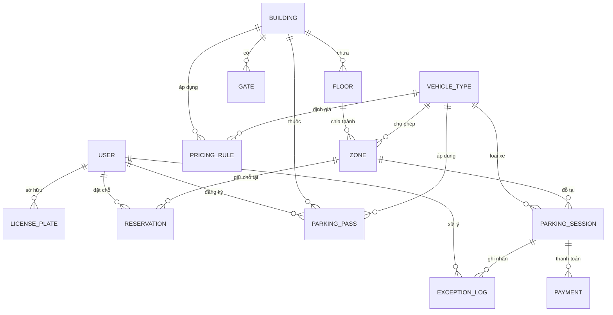
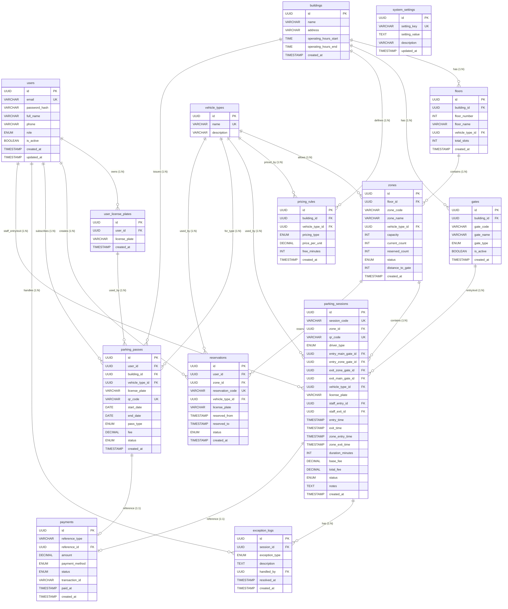

# Assessment 01 — Checkpoint 6: Data Modeling
# Smart Parking System

---

## 6.1 Conceptual Data Model (CDM)

Mô hình khái niệm — thể hiện các thực thể chính và quan hệ, chưa có kiểu dữ liệu.

### Mô tả thực thể

| Thực thể | Mô tả | Vai trò |
|---|---|---|
| **USER** | Tài khoản người dùng, phân thành 5 vai trò | Core entity |
| **LICENSE_PLATE** | Biển số xe liên kết với tài khoản Driver | Weak entity của User |
| **BUILDING** | Tòa nhà / bãi đỗ xe | Top-level location |
| **FLOOR** | Tầng trong tòa nhà | Sub-location |
| **ZONE** | Khu vực đỗ trong tầng, quản lý sức chứa | Operational unit |
| **VEHICLE_TYPE** | Phân loại phương tiện (Xe đạp, Xe máy, Ô tô, Xe tải) | Reference data |
| **GATE** | Cổng ra/vào (Main hoặc Zone level) | Infrastructure |
| **PRICING_RULE** | Bảng giá theo loại xe + building + kiểu tính | Configuration |
| **PARKING_SESSION** | Phiên gửi xe từ check-in đến check-out | Transaction |
| **RESERVATION** | Đặt chỗ trước online | Transaction |
| **PARKING_PASS** | Vé gửi xe theo gói (tháng/quý/năm) | Subscription |
| **PAYMENT** | Thanh toán (polymorphic: session hoặc pass) | Financial |
| **EXCEPTION_LOG** | Nhật ký sự cố an ninh | Audit/Log |
| **SYSTEM_SETTINGS** | Cấu hình hệ thống (key-value) | Configuration |

---

## 6.2 Logical Data Model (LDM)

Mô hình logic — đầy đủ thuộc tính, kiểu dữ liệu, PK/FK.

### Bảng `users`
| Cột | Kiểu | Ràng buộc | Mô tả |
|---|---|---|---|
| id | UUID | PK, auto-gen | |
| email | VARCHAR(100) | UNIQUE, NOT NULL | Email đăng nhập |
| password_hash | VARCHAR(255) | NOT NULL | BCrypt hash |
| full_name | VARCHAR(100) | NOT NULL | Họ tên |
| phone | VARCHAR(15) | | Số điện thoại |
| role | ENUM | NOT NULL, default DRIVER | ADMIN / MANAGER / STAFF / DRIVER / SECURITY |
| is_active | BOOLEAN | default TRUE | Trạng thái tài khoản |
| created_at | TIMESTAMP | auto | |
| updated_at | TIMESTAMP | auto | |

### Bảng `user_license_plates`
| Cột | Kiểu | Ràng buộc | Mô tả |
|---|---|---|---|
| id | UUID | PK | |
| user_id | UUID | FK → users, NOT NULL | |
| license_plate | VARCHAR(15) | NOT NULL | Biển số xe |
| created_at | TIMESTAMP | auto | |

### Bảng `buildings`
| Cột | Kiểu | Ràng buộc | Mô tả |
|---|---|---|---|
| id | UUID | PK | |
| name | VARCHAR(100) | NOT NULL | Tên tòa nhà |
| address | VARCHAR(255) | | Địa chỉ |
| operating_hours_start | TIME | | Giờ mở cửa |
| operating_hours_end | TIME | | Giờ đóng cửa |
| created_at | TIMESTAMP | auto | |

### Bảng `floors`
| Cột | Kiểu | Ràng buộc | Mô tả |
|---|---|---|---|
| id | UUID | PK | |
| building_id | UUID | FK → buildings, NOT NULL | |
| floor_number | INT | NOT NULL, UNIQUE(building_id, floor_number) | -2=B2, -1=B1, 1=T1... |
| floor_name | VARCHAR(10) | NOT NULL | "B1", "T1"... |
| vehicle_type_id | UUID | FK → vehicle_types | Loại xe ưu tiên tầng |
| total_slots | INT | default 0 | Tổng chỗ đỗ |
| created_at | TIMESTAMP | auto | |

### Bảng `zones`
| Cột | Kiểu | Ràng buộc | Mô tả |
|---|---|---|---|
| id | UUID | PK | |
| floor_id | UUID | FK → floors, NOT NULL | |
| zone_code | VARCHAR(10) | NOT NULL, UNIQUE(floor_id, zone_code) | "A", "B", "C" |
| zone_name | VARCHAR(50) | NOT NULL | "Khu A - Xe máy" |
| vehicle_type_id | UUID | FK → vehicle_types, NOT NULL | Loại xe cho phép |
| capacity | INT | NOT NULL, default 0 | Sức chứa tối đa |
| current_count | INT | NOT NULL, default 0 | Số xe đang đỗ |
| reserved_count | INT | NOT NULL, default 0 | Số chỗ đã đặt |
| status | ENUM | NOT NULL, default ACTIVE | ACTIVE / FULL / MAINTENANCE / LOCKED |
| distance_to_gate | INT | | Khoảng cách đến cổng (mét) |
| created_at | TIMESTAMP | auto | |

### Bảng `vehicle_types`
| Cột | Kiểu | Ràng buộc | Mô tả |
|---|---|---|---|
| id | UUID | PK | |
| name | VARCHAR(50) | NOT NULL, UNIQUE | Xe đạp / Xe máy / Ô tô / Xe tải |
| description | VARCHAR(255) | | Mô tả |

### Bảng `gates`
| Cột | Kiểu | Ràng buộc | Mô tả |
|---|---|---|---|
| id | UUID | PK | |
| building_id | UUID | FK → buildings, NOT NULL | |
| gate_code | VARCHAR(20) | NOT NULL | MAIN-IN, ZONE-B1... |
| gate_name | VARCHAR(50) | | Tên hiển thị |
| gate_type | ENUM | NOT NULL | MAIN_ENTRY / MAIN_EXIT / MAIN_BOTH / ZONE_ENTRY / ZONE_EXIT / ZONE_BOTH |
| is_active | BOOLEAN | default TRUE | |
| created_at | TIMESTAMP | auto | |

### Bảng `pricing_rules`
| Cột | Kiểu | Ràng buộc | Mô tả |
|---|---|---|---|
| id | UUID | PK | |
| building_id | UUID | FK → buildings, NOT NULL | |
| vehicle_type_id | UUID | FK → vehicle_types, NOT NULL | |
| pricing_type | ENUM | NOT NULL, UNIQUE(building_id, vehicle_type_id, pricing_type) | HOURLY / DAILY / MONTHLY |
| price_per_unit | DECIMAL(10,2) | NOT NULL | Giá mỗi đơn vị |
| free_minutes | INT | default 0 | Phút miễn phí đầu |
| created_at | TIMESTAMP | auto | |

### Bảng `parking_sessions`
| Cột | Kiểu | Ràng buộc | Mô tả |
|---|---|---|---|
| id | UUID | PK | |
| session_code | VARCHAR(20) | UNIQUE, NOT NULL | Mã vé: PS20240513001 |
| zone_id | UUID | FK → zones | |
| qr_code | VARCHAR(100) | UNIQUE | Mã QR |
| driver_type | ENUM | NOT NULL, default WALK_IN | WALK_IN / PRE_BOOKED / SUBSCRIBER |
| entry_main_gate_id | UUID | FK → gates | Cổng chính vào |
| entry_zone_gate_id | UUID | FK → gates | Cổng tầng vào |
| exit_zone_gate_id | UUID | FK → gates | Cổng tầng ra |
| exit_main_gate_id | UUID | FK → gates | Cổng chính ra |
| vehicle_type_id | UUID | FK → vehicle_types, NOT NULL | |
| license_plate | VARCHAR(15) | NOT NULL | Biển số xe |
| staff_entry_id | UUID | FK → users | NV check-in |
| staff_exit_id | UUID | FK → users | NV check-out |
| entry_time | TIMESTAMP | NOT NULL | Giờ vào |
| exit_time | TIMESTAMP | | Giờ ra |
| zone_entry_time | TIMESTAMP | | Giờ vào zone |
| zone_exit_time | TIMESTAMP | | Giờ ra zone |
| duration_minutes | INT | | Thời gian đỗ |
| base_fee | DECIMAL(10,2) | default 0 | Phí gốc |
| total_fee | DECIMAL(10,2) | default 0 | Phí cuối cùng |
| status | ENUM | NOT NULL, default ACTIVE | ACTIVE / COMPLETED / CANCELLED |
| notes | TEXT | | Ghi chú |
| created_at | TIMESTAMP | auto | |

### Bảng `reservations`
| Cột | Kiểu | Ràng buộc | Mô tả |
|---|---|---|---|
| id | UUID | PK | |
| user_id | UUID | FK → users, NOT NULL | |
| zone_id | UUID | FK → zones, NOT NULL | |
| reservation_code | VARCHAR(20) | UNIQUE, NOT NULL | Mã đặt chỗ |
| vehicle_type_id | UUID | FK → vehicle_types, NOT NULL | |
| license_plate | VARCHAR(15) | NOT NULL | |
| reserved_from | TIMESTAMP | NOT NULL | Bắt đầu giữ chỗ |
| reserved_to | TIMESTAMP | NOT NULL | Kết thúc giữ chỗ |
| status | ENUM | NOT NULL, default PENDING | PENDING / CONFIRMED / CANCELLED / COMPLETED |
| created_at | TIMESTAMP | auto | |

### Bảng `parking_passes`
| Cột | Kiểu | Ràng buộc | Mô tả |
|---|---|---|---|
| id | UUID | PK | |
| user_id | UUID | FK → users, NOT NULL | |
| building_id | UUID | FK → buildings, NOT NULL | |
| vehicle_type_id | UUID | FK → vehicle_types, NOT NULL | |
| license_plate | VARCHAR(15) | NOT NULL | |
| qr_code | VARCHAR(100) | UNIQUE | |
| start_date | DATE | NOT NULL | Ngày bắt đầu |
| end_date | DATE | NOT NULL | Ngày hết hạn |
| pass_type | ENUM | NOT NULL, default MONTHLY | MONTHLY / QUARTERLY / YEARLY |
| fee | DECIMAL(10,2) | NOT NULL | Phí đã thanh toán |
| status | ENUM | NOT NULL, default ACTIVE | ACTIVE / EXPIRED / CANCELLED |
| created_at | TIMESTAMP | auto | |

### Bảng `payments`
| Cột | Kiểu | Ràng buộc | Mô tả |
|---|---|---|---|
| id | UUID | PK | |
| reference_type | VARCHAR(20) | NOT NULL | SESSION / MONTHLY_PASS / RESERVATION |
| reference_id | UUID | NOT NULL | Polymorphic FK |
| amount | DECIMAL(10,2) | NOT NULL | Số tiền |
| payment_method | ENUM | NOT NULL | CASH / ONLINE / QR_CODE / BANK_TRANSFER |
| status | ENUM | NOT NULL, default PENDING | PENDING / COMPLETED / FAILED / REFUNDED |
| transaction_id | VARCHAR(100) | | Mã giao dịch bên thứ 3 |
| paid_at | TIMESTAMP | | Thời điểm thanh toán |
| created_at | TIMESTAMP | auto | |

### Bảng `exception_logs`
| Cột | Kiểu | Ràng buộc | Mô tả |
|---|---|---|---|
| id | UUID | PK | |
| session_id | UUID | FK → parking_sessions | Phiên liên quan |
| exception_type | ENUM | NOT NULL | LOST_TICKET / WRONG_PLATE / OVERTIME / WRONG_ZONE / UNPAID |
| description | TEXT | | Mô tả chi tiết |
| handled_by | UUID | FK → users | NV xử lý |
| resolved_at | TIMESTAMP | | Thời điểm giải quyết |
| created_at | TIMESTAMP | auto | |

### Bảng `system_settings`
| Cột | Kiểu | Ràng buộc | Mô tả |
|---|---|---|---|
| id | UUID | PK | |
| setting_key | VARCHAR(100) | UNIQUE, NOT NULL | Khóa cấu hình |
| setting_value | TEXT | | Giá trị |
| description | VARCHAR(255) | | Mô tả |
| updated_at | TIMESTAMP | auto | |

---

## 6.3 ERD — Logical Level (Mermaid)

Dưới đây là mã nguồn Mermaid cho sơ đồ ERD mức Logical đầy đủ 14 bảng, kiểu dữ liệu, các ràng buộc PK/FK/UNIQUE và toàn bộ các quan hệ nghiệp vụ chính xác của hệ thống:

