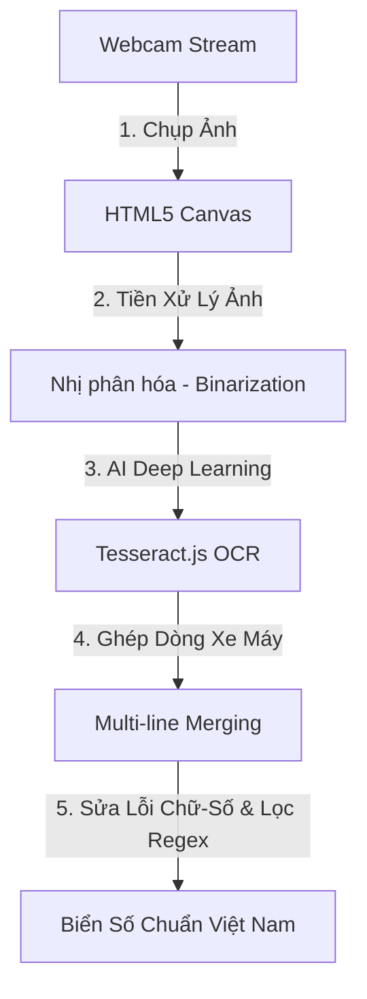

# SmartParking v2 — Tài liệu thiết kế chính thức

> Phiên bản v2 sau buổi trao đổi với giảng viên. Từ phiên bản này, hệ thống chuyển từ quản lý từng slot cố định sang quản lý theo khu/tầng (zone/floor).

---

## 1. Mục tiêu thay đổi

SmartParking v1 quản lý theo từng slot cụ thể như `B1-A01`, `B1-A02`. Sau khi phân tích lại nghiệp vụ thực tế, nhóm chuyển sang SmartParking v2:

- Không bắt buộc quản lý từng ô đỗ cụ thể.
- Quản lý sức chứa theo khu/tầng.
- Có 2 lớp cổng: cổng chính và cổng khu/tầng.
- Driver nhận QR/ticket để ra vào khu gửi xe.
- Staff xử lý check-in/check-out bình thường.
- Security xử lý ngoại lệ và sự cố.

Lý do đổi:

- Quản lý từng slot yêu cầu camera/sensor từng ô mới chính xác.
- Trong bãi xe thực tế, tài xế thường được hướng dẫn vào khu/tầng, không bắt buộc đúng một ô.
- Quản lý theo zone/floor dễ demo, dễ mở rộng và sát nghiệp vụ hơn.

---

## 2. 5 role trong hệ thống

| Role | Mô tả | Nhiệm vụ chính |
|---|---|---|
| System Admin | Quản trị hệ thống | Quản lý tài khoản, phân quyền, khóa/mở user |
| Parking Manager | Quản lý vận hành bãi xe | Cấu hình tòa nhà, tầng, khu, cổng, bảng giá, xem báo cáo |
| Parking Staff | Nhân viên xử lý xe vào/ra tại cổng | Check-in, check-out, cấp QR/ticket, xác nhận thanh toán bình thường |
| Parking Driver | Người gửi xe | Xem bãi, đặt chỗ, mua vé tháng, thanh toán, xem lịch sử |
| Security | Giám sát an ninh | Mở cổng thủ công, xử lý mất vé/QR, sai biển số, tranh chấp, sự cố |

Phân biệt quan trọng:

```text
Staff    = xử lý luồng bình thường.
Security = xử lý ngoại lệ/sự cố.
```

---

## 3. Mô hình quản lý mới: Zone/Floor thay vì Slot

### V1 — quản lý slot

```text
B1-A01 AVAILABLE
B1-A02 OCCUPIED
B1-A03 RESERVED
```

### V2 — quản lý zone/floor

```text
Tầng B1 - Khu A
- Loại xe: Xe máy
- Sức chứa: 20
- Đang có: 15
- Còn trống: 5
```

Trong v2, hệ thống gợi ý khu/tầng phù hợp, không gán exact slot.

Ví dụ:

```text
Xe máy 51A-12345 vào cổng chính
→ hệ thống gợi ý: Tầng B1 - Khu A còn 5 chỗ
→ cấp QR ticket
→ driver vào khu/tầng và tự tìm chỗ đỗ trong khu đó
```

---

## 4. Hai lớp cổng

### 4.1 Cổng chính

Cổng chính là cổng vào/ra tòa nhà hoặc bãi xe.

Nhiệm vụ:

- Giả lập camera scan biển số.
- Nhận diện hoặc chọn loại xe.
- Kiểm tra driver thuộc nhóm nào:
  - Vãng lai.
  - Đã đặt trước.
  - Có vé tháng.
- Tạo parking session.
- Cấp QR/ticket.
- Gợi ý khu/tầng phù hợp.
- Xử lý thanh toán cuối nếu cần.
- Mở barrier chính.

### 4.2 Cổng khu/tầng

Cổng khu/tầng nằm trước mỗi khu hoặc tầng gửi xe.

Nhiệm vụ:

- Driver quét QR/thẻ để vào khu.
- Ghi nhận xe đã vào khu/tầng nào.
- Driver quét QR khi ra khỏi khu.
- Hiển thị thời gian gửi và phí nếu cần.
- Cập nhật counter khu/tầng.

---

## 5. Loại phiên gửi xe

Role `Driver` chỉ là người gửi xe. Còn mỗi lần gửi xe sẽ có loại phiên:

| Session Type | Ý nghĩa |
|---|---|
| WALK_IN | Xe vãng lai, không đặt trước, không vé tháng |
| PRE_BOOKED | Xe đã đặt chỗ/khu trước trên web |
| MONTHLY | Xe có vé tháng hợp lệ |

---

## 6. Luồng xe vãng lai

### Check-in

```text
1. Driver tới cổng chính.
2. Staff dùng camera giả lập scan biển số.
3. Staff xác nhận loại xe.
4. Hệ thống tìm zone còn chỗ phù hợp.
5. Hệ thống tạo parking session loại WALK_IN.
6. Hệ thống sinh QR/ticket.
7. Staff cấp QR/ticket cho driver.
8. Driver tới cổng khu/tầng.
9. Driver quét QR để vào khu.
10. Hệ thống tăng zone counter.
```

### Check-out

```text
1. Driver ra khỏi khu/tầng.
2. Driver quét QR tại cổng khu/tầng.
3. Hệ thống tính thời gian gửi và phí.
4. Driver xuống cổng chính.
5. Staff xác nhận thanh toán.
6. Hệ thống cập nhật payment COMPLETED.
7. Hệ thống cập nhật session COMPLETED.
8. Cổng chính mở.
```

---

## 7. Luồng xe đặt trước

```text
1. Driver đăng nhập web.
2. Driver chọn loại xe, thời gian đến, khu/tầng nếu có.
3. Hệ thống tạo reservation và giữ capacity trong zone.
4. Driver tới cổng chính.
5. Staff scan biển số hoặc mã đặt chỗ.
6. Hệ thống xác nhận reservation còn hiệu lực.
7. Hệ thống tạo parking session loại PRE_BOOKED.
8. Hệ thống cấp QR/ticket.
9. Driver vào khu/tầng bằng QR.
10. Khi ra, driver có thể thanh toán tại cổng khu/tầng hoặc cổng chính.
```

---

## 8. Luồng xe vé tháng

```text
1. Driver đăng ký/mua vé tháng theo biển số cố định.
2. Driver tới cổng chính.
3. Camera giả lập scan biển số.
4. Hệ thống kiểm tra monthly pass còn hạn.
5. Nếu hợp lệ, hệ thống tạo session loại MONTHLY.
6. Hệ thống cấp QR/ticket hoặc xác nhận thẻ.
7. Driver vào khu/tầng bằng QR.
8. Khi ra, driver quét QR tại cổng khu/tầng.
9. Không cần thanh toán theo lượt.
10. Khi tới cổng chính, barrier tự mở nếu session hợp lệ.
```

Quy tắc vé tháng:

- 1 vé tháng gắn với 1 biển số cố định.
- Phân theo loại xe: xe máy/ô tô.
- Có thời hạn 30 ngày hoặc theo ngày bắt đầu/kết thúc.
- Không giới hạn số lượt ra/vào trong thời gian còn hạn.
- Không giới hạn khu, miễn đúng loại phương tiện và khu còn sức chứa.

---

## 9. Security xử lý ngoại lệ

Security không xử lý check-in/check-out bình thường. Security xử lý khi có sự cố:

- Driver mất QR/ticket.
- Biển số scan sai.
- QR không hợp lệ.
- Xe vào sai khu/tầng.
- Vé tháng hết hạn nhưng vẫn yêu cầu ra/vào.
- Tranh chấp phí.
- Payment lỗi.
- Mở cổng thủ công.
- Xác minh thủ công xe/người.

Luồng ngoại lệ mẫu:

```text
1. Staff phát hiện luồng bình thường không xử lý được.
2. Staff chuyển case sang Security.
3. Security tra cứu biển số/session/QR.
4. Security xác minh thông tin.
5. Security xử lý thủ công hoặc từ chối.
6. Hệ thống lưu ExceptionLog/GateEvent.
```

### 9.1 Công cụ nghiệp vụ trên Security Dashboard

Nhân viên bảo an (Security) được cung cấp một giao diện chốt an ninh trung tâm (Security Dashboard) riêng để tác nghiệp:

1. **Điều khiển Barrier khẩn cấp (Emergency Overrides)**: Cho phép Security mở bất kỳ barrier nào tại các làn ra/vào. Hệ thống bắt buộc nhập lý do (ví dụ: "Xe cấp cứu", "Sự cố chập điện", "Mất vé vãng lai").
2. **Lập biên bản Sự cố & Log An ninh (Incident Report)**: Ghi nhận nhanh các vụ việc như mất thẻ, AI đọc sai biển số cần nhập tay, xe chết máy cản trở giao thông.
3. **Đồng bộ thời gian thực**: Mọi thao tác override cổng và biên bản sự cố đều được đồng bộ tức thì sang **Log Ngoại Lệ của Admin** nhằm phục vụ hậu kiểm, chống thất thoát doanh thu bãi xe.

---

## 10. Redis trong SmartParking v2

Redis dùng cho dữ liệu tốc độ cao và xử lý concurrent request.

### 10.1 Zone counter

```text
zone:count:{zoneId}     → số xe hiện tại trong zone
zone:capacity:{zoneId}  → sức chứa tối đa của zone
```

Khi xe vào zone:

```text
INCR zone:count:{zoneId}
```

Khi xe ra zone:

```text
DECR zone:count:{zoneId}
```

### 10.2 Distributed lock theo zone

```text
zone:lock:{zoneId}
```

Dùng khi zone gần đầy để tránh nhiều request cùng chiếm chỗ cuối cùng.

### 10.3 Cache session QR

```text
session:qr:{qrCode}
```

Dùng để quét QR nhanh tại cổng.

### 10.4 Cache vé tháng

```text
pass:monthly:{licensePlate}
```

Dùng để camera scan biển số và kiểm tra vé tháng nhanh.

Lưu ý:

```text
PostgreSQL vẫn là nguồn dữ liệu chính.
Redis là counter/cache/lock để tăng tốc và giảm race condition.
```

---

## 11. Giải pháp Camera & AI OCR Đã Triển Khai (Thật 100%)

Thay vì chỉ dừng lại ở mức "Giả lập tĩnh" như thiết kế ban đầu, SmartParking v2 đã **triển khai thành công 100%** giải pháp **Client-Side AI OCR** chạy trực tiếp trên trình duyệt bằng Webcam thực tế mà không cần thiết bị IoT nhúng phức tạp.

### 11.1 Kiến trúc & Công nghệ Sử dụng
* **WebRTC API**: Truy cập trực tiếp Webcam/Camera của thiết bị PC, điện thoại hoặc máy tính bảng của nhân viên bãi xe tại cổng bảo vệ.
* **HTML5 Canvas API**: Chụp và xử lý các điểm ảnh thô (Pixel manipulation) thời gian thực.
* **Tesseract.js**: Nhúng mô hình Trí tuệ nhân tạo (AI OCR Deep Learning) chạy trực tiếp trên Client thông qua CDN siêu nhẹ, đảm bảo tốc độ cao và bảo mật dữ liệu tuyệt đối (không truyền ảnh về server).

### 11.2 Quy trình Xử lý & Thuật toán Đột phá
Hệ thống xử lý ảnh và bóc tách biển số xe qua 5 bước nghiêm ngặt theo tiêu chuẩn Computer Vision:



1. **Tiền xử lý ảnh (Computer Vision Binarization)**:
   * Khi click chụp, hệ thống chuyển bức ảnh sang thang độ xám (Grayscale).
   * Áp dụng thuật toán **Binary Thresholding** (ngưỡng sáng 125): Chuyển ảnh sang dạng đen trắng nhị phân hoàn toàn. Chữ số và ký tự đen sẽ được làm sắc nét cực hạn trên nền trắng tinh khiết, loại bỏ hoàn toàn bóng mờ và phản quang.
2. **Ghép dòng thông minh (Multi-line Merging)**:
   * Khắc phục điểm yếu chí mạng của biển số xe máy Việt Nam (biển số 2 dòng như dòng 1: `99-E1`, dòng 2: `222.68`).
   * Hệ thống tự động phát hiện các ký tự xuống dòng `\n` của AI và nối các dòng lại thành một chuỗi duy nhất trước khi phân tích.
3. **Sửa lỗi nhận dạng thông minh (Auto Error Correction)**:
   * Tự động sửa chữa các ký tự nhầm lẫn chữ-số kinh điển của AI OCR:
     * Đầu biển số (2 ký tự đầu) là SỐ: Ép chữ `O, D, B, G` thành số `0, 0, 8, 6`.
     * Ký hiệu Series (ký tự thứ 3) là CHỮ: Ép số `0, 1, 8` thành chữ `D, I, B`.
     * Các số thứ tự phía sau là SỐ: Ép chữ `O, I, B, S` thành số `0, 1, 8, 5`.
4. **Bộ bóc tách Regex chuyên biệt cho Việt Nam (Vietnamese License Plate Regex Parser)**:
   * Hệ thống so khớp chuỗi thô với 2 biểu thức chính quy (Regex) tiêu chuẩn:
     * **Mẫu xe máy & ô tô mới**: `/([0-9]{2})([A-Z])([0-9A-Z])([0-9]{4,5})/` (Ví dụ: `99E122268`).
     * **Mẫu ô tô tiêu chuẩn**: `/([0-9]{2})([A-Z])([0-9]{4,5})/` (Ví dụ: `30A88888`).
   * Lọc lấy chính xác phần lõi biển số khớp khuôn mẫu, loại bỏ hoàn toàn 100% ký tự rác xung quanh do camera phản quang hay xước xát gây ra.
5. **Suy luận loại phương tiện (Vehicle Type Inference)**:
   * Tự động phát hiện các series xe máy phổ dụng (như `A1, B1, E1, F1`) để tự động chuyển loại phương tiện trong form check-in thành **Xe máy**, giúp Staff tiết kiệm 100% thời gian nhập tay.

### 11.3 Phương án dự phòng (Backup Simulation)
Hệ thống vẫn giữ lại 2 nút **Mô phỏng chụp xe máy (59A1)** và **Mô phỏng ô tô (30G)** chạy hiệu ứng laser quét ảnh đẹp mắt phòng trường hợp đi thi không có xe thật hoặc webcam bị hỏng vật lý, đảm bảo buổi demo an toàn tuyệt đối.

---

## 12. Thanh toán

| Loại driver | Cổng khu/tầng | Cổng chính |
|---|---|---|
| WALK_IN | Chỉ xem giá | Bắt buộc thanh toán |
| PRE_BOOKED | Có thể thanh toán | Có thể thanh toán |
| MONTHLY | Quét QR ra | Tự động mở nếu hợp lệ |

Phương thức thanh toán MVP:

- Tiền mặt.
- Chuyển khoản giả lập.

Payment gateway thật như VNPay/Momo để phase sau.

---

## 13. MVP ưu tiên

MVP cần hoàn thành trước:

1. Login theo 5 role.
2. Staff check-in xe vãng lai theo zone.
3. Gợi ý zone còn chỗ.
4. Sinh QR/session.
5. Zone counter tăng/giảm.
6. Staff check-out xe vãng lai.
7. Tính phí.
8. Security xử lý ngoại lệ cơ bản: mất QR hoặc sai biển số.
9. Manager xem zone capacity dashboard cơ bản.

Chưa ưu tiên ngay:

- OCR thật.
- Payment gateway thật.
- Dashboard biểu đồ nâng cao.
- Auto barrier thật.
- AI nhận diện xe thật.

---

## 14. Kết luận

SmartParking v2 là hệ thống quản lý bãi xe theo khu/tầng với 5 role và 2 lớp cổng. Luồng chính vẫn xoay quanh ParkingSession, nhưng ParkingSession gắn với `zone_id` thay vì `slot_id`. Staff xử lý luồng xe bình thường, Security xử lý ngoại lệ, Manager quản lý vận hành, Admin quản lý tài khoản, Driver sử dụng dịch vụ gửi xe.
