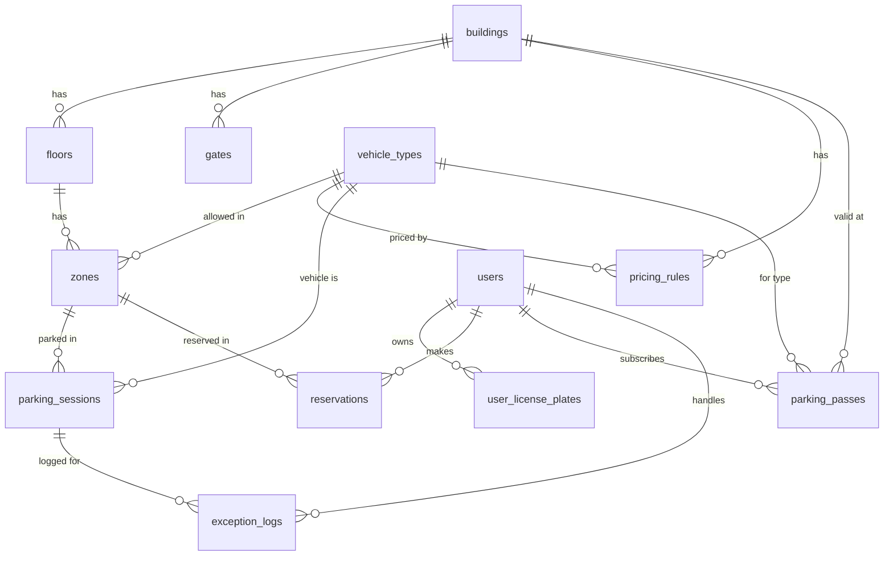

# 📋 SRS — Đặc Tả Yêu Cầu Phần Mềm
## Hệ thống Quản lý Bãi đỗ xe Thông minh (Smart Parking System)

| Thông tin | Chi tiết |
|---|---|
| **Phiên bản** | 2.0 — Cập nhật 01/06/2026 |
| **Công nghệ** | Java Spring Boot 3 + React 18 + PostgreSQL |
| **Kiến trúc** | Monolithic REST API + SPA Frontend |

---

## 1. Giới thiệu

### 1.1 Mục đích
Tài liệu mô tả đầy đủ yêu cầu chức năng và phi chức năng của hệ thống **Smart Parking** — một nền tảng quản lý bãi đỗ xe đa tầng, hỗ trợ giám sát realtime, mô phỏng 3D Digital Twin, và phân quyền theo 5 vai trò.

### 1.2 Phạm vi hệ thống
- Quản lý vận hành bãi đỗ xe đa tầng (Building → Floor → Zone)
- Check-in / Check-out xe với tính phí tự động
- Đặt chỗ trước (Reservation) và đăng ký vé gửi xe theo gói (Parking Pass)
- Giám sát realtime qua Dashboard và mô phỏng 3D Digital Twin
- Xử lý sự cố an ninh và ghi nhật ký ngoại lệ
- Thanh toán đa phương thức (tiền mặt, chuyển khoản, QR Code)

### 1.3 Đối tượng sử dụng

| # | Vai trò | Mô tả |
|---|---|---|
| 1 | **Admin** | Quản trị toàn bộ hệ thống: users, zones, gates, pricing, settings |
| 2 | **Manager** | Giám sát vận hành, xem báo cáo, hậu kiểm sự cố an ninh |
| 3 | **Staff** | Nhân viên bãi xe: check-in/check-out, tra cứu phiên gửi |
| 4 | **Driver** | Tài xế: xem phiên gửi, đặt chỗ, đăng ký gói dịch vụ, quản lý biển số |
| 5 | **Security** | Bảo vệ: giám sát cổng, tuần tra kỹ thuật số, quét biển số đối soát, duyệt barrier từ xa, SOS khẩn cấp, quản lý danh sách đen |

---

## 2. Kiến trúc hệ thống

### 2.1 Technology Stack

| Layer | Công nghệ |
|---|---|
| **Backend** | Java 17, Spring Boot 3, Spring Security + JWT, Spring Data JPA, Lombok |
| **Frontend** | React 18, Vite, React Router, Three.js (3D Digital Twin), GSAP (Animation) |
| **AI/OCR** | Tesseract.js v4 — nhận diện biển số xe bằng camera, chạy trực tiếp trên trình duyệt (CDN) |
| **Database** | PostgreSQL (Production) / H2 (Dev) |
| **Cache/Pub-Sub** | Redis 7 — Pub/Sub broadcast SOS khẩn cấp, cache danh sách đen biển số |
| **Auth** | JWT Bearer Token, BCrypt password hashing |
| **Realtime** | WebSocket + Redis Pub/Sub — đồng bộ message giữa các server instance |
| **API** | RESTful JSON, namespace `/api/v1/{role}/...` |

### 2.2 Sơ đồ kiến trúc

```
┌─────────────────────────────────────────────────┐
│                  React SPA (Vite)                │
│  ┌──────┐ ┌──────┐ ┌──────┐ ┌──────┐ ┌────────┐ │
│  │Admin │ │Mngr  │ │Staff │ │Driver│ │Security│ │
│  │Dash  │ │Dash  │ │Dash  │ │Dash  │ │Dash    │ │
│  └──┬───┘ └──┬───┘ └──┬───┘ └──┬───┘ └───┬────┘ │
│     └────────┴────────┴────────┴─────────┘      │
│                  Axios HTTP Client               │
└────────────────────┬────────────────────────────┘
                     │ REST API (JSON)
┌────────────────────┴────────────────────────────┐
│           Spring Boot 3 Backend                  │
│  ┌────────────┐ ┌──────────┐ ┌────────────────┐ │
│  │  Auth      │ │ Business │ │  Admin Mgmt    │ │
│  │ Controller │ │Controllers│ │  Controller    │ │
│  └─────┬──────┘ └────┬─────┘ └───────┬────────┘ │
│        └─────────────┼───────────────┘           │
│              Spring Data JPA                     │
│              14 Entity Classes                   │
└────────────────────┬────────────────────────────┘
                     │ JDBC
              ┌──────┴──────┐
              │ PostgreSQL  │
              │  14 Tables  │
              └─────────────┘
```

---

## 3. Cơ sở dữ liệu — ERD

### 3.1 Danh sách bảng (14 bảng)

| # | Bảng | Mô tả | Quan hệ chính |
|---|---|---|---|
| 1 | `users` | Tài khoản người dùng (5 roles) | — |
| 2 | `user_license_plates` | Biển số xe của Driver | → users |
| 3 | `buildings` | Tòa nhà / bãi đỗ xe | — |
| 4 | `floors` | Tầng trong tòa nhà | → buildings, → vehicle_types |
| 5 | `zones` | Khu vực đỗ xe trong tầng | → floors, → vehicle_types |
| 6 | `vehicle_types` | Loại phương tiện (Xe đạp, Xe máy, Ô tô, Xe tải) | — |
| 7 | `gates` | Cổng ra/vào (Main + Zone) | → buildings |
| 8 | `pricing_rules` | Bảng giá (HOURLY / DAILY / MONTHLY) | → buildings, → vehicle_types |
| 9 | `parking_sessions` | Phiên gửi xe (check-in → check-out) | → zones, → gates, → vehicle_types, → users |
| 10 | `reservations` | Đặt chỗ trước | → users, → zones, → vehicle_types |
| 11 | `parking_passes` | Vé gửi xe theo gói (tháng/quý/năm) | → users, → buildings, → vehicle_types |
| 12 | `payments` | Thanh toán (polymorphic ref) | ref → sessions / passes |
| 13 | `exception_logs` | Nhật ký sự cố an ninh | → parking_sessions, → users |
| 14 | `system_settings` | Cấu hình hệ thống | — |

### 3.2 ERD Diagram



### 3.3 Chi tiết bảng quan trọng

#### `parking_sessions`
| Cột | Kiểu | Mô tả |
|---|---|---|
| id | UUID (PK) | |
| session_code | VARCHAR(20) | Mã vé duy nhất, VD: PS20240513001 |
| zone_id | UUID (FK) | Khu vực đỗ |
| driver_type | ENUM | WALK_IN / PRE_BOOKED / SUBSCRIBER |
| entry_main_gate_id | UUID (FK) | Cổng chính vào |
| entry_zone_gate_id | UUID (FK) | Cổng tầng vào |
| exit_zone_gate_id | UUID (FK) | Cổng tầng ra |
| exit_main_gate_id | UUID (FK) | Cổng chính ra |
| vehicle_type_id | UUID (FK) | Loại xe |
| license_plate | VARCHAR(15) | Biển số xe |
| staff_entry_id | UUID (FK) | NV check-in |
| staff_exit_id | UUID (FK) | NV check-out |
| entry_time | TIMESTAMP | Giờ vào |
| exit_time | TIMESTAMP | Giờ ra |
| duration_minutes | INT | Thời gian đỗ (phút) |
| base_fee / total_fee | DECIMAL | Phí tính |
| status | ENUM | ACTIVE / COMPLETED / CANCELLED |

#### `parking_passes`
| Cột | Kiểu | Mô tả |
|---|---|---|
| id | UUID (PK) | |
| user_id | UUID (FK) | Driver sở hữu |
| building_id | UUID (FK) | Bãi xe áp dụng |
| vehicle_type_id | UUID (FK) | Loại xe |
| license_plate | VARCHAR(15) | Biển số |
| start_date / end_date | DATE | Hiệu lực |
| pass_type | ENUM | MONTHLY / QUARTERLY / YEARLY |
| fee | DECIMAL | Phí đã thanh toán |
| status | ENUM | ACTIVE / EXPIRED / CANCELLED |

#### `pricing_rules`
| Cột | Kiểu | Mô tả |
|---|---|---|
| id | UUID (PK) | |
| building_id | UUID (FK) | |
| vehicle_type_id | UUID (FK) | |
| pricing_type | ENUM | HOURLY / DAILY / MONTHLY |
| price_per_unit | DECIMAL | Giá mỗi đơn vị |
| free_minutes | INT | Phút miễn phí đầu |

---

## 4. Dữ liệu mẫu (Seed Data)

Hệ thống tự khởi tạo khi chạy lần đầu:

| Hạng mục | Chi tiết |
|---|---|
| **Building** | SmartParking Tower — 123 Nguyễn Văn Linh, Q7, TP.HCM |
| **4 Tầng** | B2 (Xe máy, 120 chỗ), B1 (Xe máy, 140 chỗ), T1 (Ô tô, 80 chỗ), T2 (Xe tải, 40 chỗ) |
| **10 Zones** | B2: A(50), B(40), C(30) · B1: A(60), B(50), C(30) · T1: A(40), B(40) · T2: A(20), B(20) |
| **6 Cổng** | MAIN-IN, MAIN-OUT, ZONE-B1, ZONE-B2, ZONE-T1, ZONE-T2 |
| **4 Loại xe** | Xe đạp, Xe máy, Ô tô, Xe tải |
| **12 Pricing Rules** | 4 loại × 3 kiểu (Hourly/Daily/Monthly) |
| **5 Users** | admin, manager, staff, driver, security @parking.vn / pass: 123456 |

**Bảng giá mặc định:**

| Loại xe | Giờ | Ngày | Tháng | Phút miễn phí |
|---|---|---|---|---|
| Xe đạp | 2.000đ | 10.000đ | 100.000đ | 30 phút |
| Xe máy | 5.000đ | 25.000đ | 200.000đ | 15 phút |
| Ô tô | 15.000đ | 80.000đ | 1.500.000đ | 15 phút |
| Xe tải | 25.000đ | 120.000đ | 2.500.000đ | 15 phút |

---

## 5. Đặc tả Use Case

### UC-01: Đăng nhập hệ thống
| | |
|---|---|
| **Actor** | Admin, Manager, Staff, Driver, Security |
| **Trigger** | Truy cập `/login` |
| **Luồng chính** | 1. Nhập email + password → 2. `POST /auth/login` → 3. Backend xác thực BCrypt → 4. Trả JWT token + user info → 5. Frontend lưu localStorage, redirect theo role |
| **Ngoại lệ** | Sai mật khẩu → 401; Tài khoản bị khóa → 403 |

### UC-02: Quản lý cấu hình bãi xe (Admin)
| | |
|---|---|
| **Actor** | Admin |
| **Mô tả** | CRUD zones, gates, pricing rules, users, system settings |
| **API** | `POST/PUT/DELETE /admin/zones`, `/admin/gates`, `/admin/pricing-rules`, `/admin/users` |
| **Luồng** | 1. Admin vào Dashboard → 2. Chọn tab quản lý → 3. Thêm/Sửa/Xóa → 4. Backend validate + persist → 5. Refresh data |

### UC-03: Check-in xe vào bãi (Staff)
| | |
|---|---|
| **Actor** | Staff |
| **Precondition** | Zone còn chỗ trống |
| **Luồng chính** | 1. Staff nhập biển số (3 cách: gõ thủ công / quét QR / AI OCR camera Tesseract.js) + chọn Zone + VehicleType → 2. `POST /staff/sessions/checkin` → 3. Backend tạo ParkingSession (status=ACTIVE), tăng zone.currentCount → 4. Trả sessionCode + QR → 5. Mở barrier |
| **AI OCR** | Camera chụp biển số → tiền xử lý ảnh (nhị phân hóa, tăng contrast) → Tesseract.js nhận diện ký tự → hậu xử lý sửa lỗi (O→0, I→1) → tự điền form |
| **Ngoại lệ** | Zone đầy → 400; Biển số trống → 400 |
| **Postcondition** | zone.currentCount += 1, session ACTIVE |

### UC-04: Check-out xe ra bãi (Staff)
| | |
|---|---|
| **Actor** | Staff |
| **Precondition** | Có session ACTIVE cho biển số |
| **Luồng chính** | 1. Staff nhập biển số → 2. `POST /staff/sessions/checkout` → 3. Backend tính duration + fee theo pricing_rules → 4. Cập nhật session (exit_time, totalFee, status=COMPLETED), giảm zone.currentCount → 5. Trả thông tin thanh toán |
| **Tính phí** | `duration_minutes × (pricePerUnit / 60)`, trừ freeMinutes đầu |
| **Postcondition** | zone.currentCount -= 1, session COMPLETED |

### UC-05: Đặt chỗ trước (Driver)
| | |
|---|---|
| **Actor** | Driver |
| **Luồng chính** | 1. Driver chọn Zone + VehicleType + biển số + thời gian → 2. `POST /driver/reservations` → 3. Backend tạo Reservation (CONFIRMED), tăng zone.reservedCount → 4. Hiển thị mã đặt chỗ + QR |
| **Hủy** | `DELETE /driver/reservations/{id}` → giảm zone.reservedCount |

### UC-06: Đăng ký gói dịch vụ đỗ xe (Driver)
| | |
|---|---|
| **Actor** | Driver |
| **Precondition** | Có pricing_rules MONTHLY trong DB |
| **Luồng chính** | 1. Driver vào tab "Hồ sơ & hội viên" → 2. `GET /driver/pricing-plans` lấy danh sách gói → 3. Chọn loại xe + gói (Tháng/Quý/Năm) → 4. Nhập biển số → 5. `POST /driver/parking-passes` → 6. Backend tính phí (Monthly×1 / ×3 / ×12×0.9), tạo ParkingPass (ACTIVE) → 7. Hiển thị vé với progress bar |
| **Tính phí** | MONTHLY = pricePerUnit, QUARTERLY = ×3, YEARLY = ×12 × 0.9 (giảm 10%) |

### UC-07: Quản lý biển số xe (Driver)
| | |
|---|---|
| **Actor** | Driver |
| **Luồng** | 1. `GET /driver/plates` lấy danh sách → 2. `POST /driver/plates` thêm mới → 3. `DELETE /driver/plates?plate=XXX` xóa |

### UC-08: Xem lịch sử gửi xe (Driver/Staff)
| | |
|---|---|
| **Actor** | Driver, Staff |
| **API** | `GET /driver/sessions/history?plate=XXX` (theo biển số) hoặc `GET /staff/sessions/history` (toàn bộ) |

### UC-09: Mở barrier khẩn cấp (Security)
| | |
|---|---|
| **Actor** | Security |
| **Luồng** | 1. Security nhập lý do + biển số liên quan → 2. Mở barrier → 3. `POST /security/exceptions` ghi log sự cố → 4. Tự đóng barrier sau 8s → 5. Manager hậu kiểm qua exception_logs |

### UC-10: Lập biên bản sự cố (Security)
| | |
|---|---|
| **Actor** | Security |
| **Loại sự cố** | LOST_TICKET, WRONG_PLATE, OVERTIME, WRONG_ZONE, UNPAID |
| **Luồng** | 1. Security chọn loại sự cố + mô tả + hành động → 2. `POST /security/exceptions` → 3. Lưu ExceptionLog vào DB → 4. Manager/Admin xem qua `GET /security/exceptions` |

### UC-11: Giám sát bãi xe qua Dashboard (Manager/Admin)
| | |
|---|---|
| **Actor** | Manager, Admin |
| **Luồng** | 1. Xem Dashboard realtime: tổng xe, doanh thu, tỷ lệ lấp đầy → 2. Dữ liệu auto-refresh mỗi 5-10s → 3. Biểu đồ doanh thu 7 ngày, phân bổ loại xe |

### UC-12: Mô phỏng 3D Digital Twin (All Roles)
| | |
|---|---|
| **Actor** | Admin, Manager, Staff, Driver, Security |
| **Mô tả** | Hiển thị bãi đỗ xe dạng 3D tương tác bằng Three.js |
| **Tính năng** | Click vào zone → hiện thông tin chi tiết (sức chứa, trạng thái), xem theo tầng, panel thống kê vận hành |
| **Truy cập** | Manager/Admin: tab trong Dashboard · Staff/Driver/Security: route `/{role}/3d-map` |

### UC-13: Tuần tra kỹ thuật số & Quét biển số đối soát (Security)
| | |
|---|---|
| **Actor** | Security |
| **Mô tả** | Bảo an đi tuần quét QR phân khu check-in ca, dùng camera quét biển số xe nghi vấn để đối soát |
| **Luồng** | 1. Quét QR zone → ghi log tuần tra → 2. Chụp biển số xe nghi vấn → 3. OCR + đối chiếu Active Sessions → 4. Kết quả: Hợp lệ / WRONG_ZONE / Đỗ lậu → 5. Nếu vi phạm → lập biên bản exception_log |

### UC-14: Duyệt mở Barrier từ xa qua WebSocket (Security)
| | |
|---|---|
| **Actor** | Security, Staff |
| **Mô tả** | Staff gặp sự cố tại cabin gửi cứu trợ khẩn cấp, Security nhận realtime và phê duyệt/từ chối mở barrier |
| **Luồng** | 1. Staff bấm "Cứu trợ khẩn cấp" → 2. WebSocket push tới Security Dashboard (còi hú) → 3. Security xem chi tiết (Gate, biển số, lý do) → 4. Bấm "Phê duyệt" → barrier mở / hoặc "Từ chối" → 5. Ghi log exception handled_by Security |

### UC-15: Kích hoạt Emergency SOS Mode (Security)
| | |
|---|---|
| **Actor** | Security, Manager/Admin |
| **Mô tả** | Tình huống cháy nổ/ngập lụt — Security kích hoạt SOS mở toàn bộ barrier và cảnh báo toàn hệ thống |
| **Công nghệ** | Redis Pub/Sub broadcast tới tất cả server instance → WebSocket push tới mọi client |
| **Luồng** | 1. Security nhấn giữ nút SOS 3 giây (tránh nhầm) → 2. Server publish lên Redis channel `sos_alert` → 3. Tất cả server instance nhận và mở toàn bộ barrier → 4. WebSocket broadcast cảnh báo ĐỎ RỰC tới ALL Dashboards → 5. Khóa thao tác bình thường → 6. Manager/Admin bấm "Tắt SOS" → trở lại bình thường → 7. Ghi log: ai kích hoạt, ai tắt, thời gian |

### UC-16: Quản lý Danh sách đen biển số (Security)
| | |
|---|---|
| **Actor** | Security |
| **Mô tả** | Thêm biển số xe trộm cắp/gây rối vào blacklist, hệ thống tự chặn check-in và cảnh báo khi xe đen xuất hiện |
| **Công nghệ** | Redis cache danh sách đen (`SET blacklist:{plate} {reason}`) — tra cứu < 1ms khi check-in |
| **Luồng** | 1. Security thêm biển số + lý do vào blacklist → lưu DB + đồng bộ vào Redis cache → 2. Khi Staff check-in → Backend check Redis cache trước (< 1ms), nếu có → chặn check-in + WebSocket alert tới Security → 3. Hiện chuông báo động + vị trí cổng chính xác → 4. Security chạy đến can thiệp |

---

## 6. API Endpoints

### 6.1 Authentication
| Method | Endpoint | Mô tả |
|---|---|---|
| POST | `/api/v1/auth/login` | Đăng nhập, trả JWT |

### 6.2 Parking Config (Public)
| Method | Endpoint | Mô tả |
|---|---|---|
| GET | `/api/v1/parking/config` | Lấy toàn bộ cấu hình: buildings, floors, zones, gates, vehicleTypes |

### 6.3 Staff APIs
| Method | Endpoint | Mô tả |
|---|---|---|
| POST | `/api/v1/staff/sessions/checkin` | Check-in xe |
| POST | `/api/v1/staff/sessions/checkout` | Check-out xe |
| GET | `/api/v1/staff/sessions/history` | Toàn bộ lịch sử phiên |

### 6.4 Driver APIs
| Method | Endpoint | Mô tả |
|---|---|---|
| GET | `/api/v1/driver/plates` | Lấy biển số xe |
| POST | `/api/v1/driver/plates` | Thêm biển số |
| DELETE | `/api/v1/driver/plates?plate=XXX` | Xóa biển số |
| GET | `/api/v1/driver/sessions/active?plate=XXX` | Phiên đang hoạt động |
| GET | `/api/v1/driver/sessions/history?plate=XXX` | Lịch sử theo biển số |
| POST | `/api/v1/driver/reservations` | Đặt chỗ |
| GET | `/api/v1/driver/reservations` | Danh sách đặt chỗ |
| DELETE | `/api/v1/driver/reservations/{id}` | Hủy đặt chỗ |
| GET | `/api/v1/driver/pricing-plans` | Danh sách gói dịch vụ |
| GET | `/api/v1/driver/parking-passes` | Vé đã mua |
| POST | `/api/v1/driver/parking-passes` | Đăng ký gói dịch vụ |
| POST | `/api/v1/driver/payments/confirm` | Xác nhận thanh toán |

### 6.5 Admin APIs
| Method | Endpoint | Mô tả |
|---|---|---|
| GET/POST/PUT/DELETE | `/api/v1/admin/users` | CRUD users |
| POST/PUT/DELETE | `/api/v1/admin/zones` | CRUD zones |
| POST/PUT/DELETE | `/api/v1/admin/gates` | CRUD gates |
| POST/PUT/DELETE | `/api/v1/admin/pricing-rules` | CRUD pricing |
| GET/POST/PUT/DELETE | `/api/v1/admin/parking-passes` | Quản lý vé gửi xe |
| POST | `/api/v1/admin/parking-passes/{id}/renew` | Gia hạn vé |
| GET/PUT | `/api/v1/admin/settings` | Cấu hình hệ thống |

### 6.6 Security APIs
| Method | Endpoint | Mô tả |
|---|---|---|
| POST | `/api/v1/security/exceptions` | Ghi log sự cố |
| GET | `/api/v1/security/exceptions` | Xem danh sách sự cố |
| POST | `/api/v1/security/patrol/checkin` | Check-in ca tuần tra (quét QR zone) |
| POST | `/api/v1/security/patrol/scan-plate` | Quét biển số đối soát Active Sessions |
| POST | `/api/v1/security/barrier/approve` | Phê duyệt mở barrier từ xa (WebSocket) |
| POST | `/api/v1/security/sos/activate` | Kích hoạt SOS khẩn cấp |
| POST | `/api/v1/security/sos/deactivate` | Tắt SOS (chỉ Manager/Admin) |
| GET/POST/DELETE | `/api/v1/security/blacklist` | CRUD danh sách đen biển số |

---

## 7. Giao diện người dùng

### 7.1 Danh sách màn hình

| # | Màn hình | Route | Role |
|---|---|---|---|
| 1 | Login | `/login` | All |
| 2 | Admin Dashboard | `/admin/dashboard` | Admin |
| 3 | Manager Dashboard | `/manager/dashboard` | Manager |
| 4 | Staff Dashboard | `/staff/dashboard` | Staff |
| 5 | Staff Check-in | `/staff/check-in` | Staff |
| 6 | Staff Check-out | `/staff/check-out` | Staff |
| 7 | Staff Map (2D) | `/staff/map` | Staff |
| 8 | Staff History | `/staff/history` | Staff |
| 9 | Driver Dashboard | `/driver/dashboard` | Driver |
| 10 | Driver Map (2D) | `/driver/map` | Driver |
| 11 | Security Dashboard | `/security/dashboard` | Security |
| 12 | 3D Digital Twin | `/{role}/3d-map` | All |

### 7.2 Thiết kế UI/UX
- **Design System**: Slate-900 sidebar, glassmorphism cards, gradient accents
- **Animation**: GSAP — sidebar slide-in, cards stagger, stats bounce
- **3D Engine**: Three.js — raycasting click zones, color-coded occupancy
- **Responsive**: Desktop-first, collapsible sidebar
- **Realtime**: Auto-refresh data mỗi 5-10 giây

---

## 8. Yêu cầu phi chức năng

| # | Yêu cầu | Mô tả |
|---|---|---|
| NFR-01 | **Bảo mật** | JWT authentication, BCrypt hashing, RBAC phân quyền theo role, CORS configured |
| NFR-02 | **Hiệu năng** | API response < 500ms, 3D scene render 60fps, useMemo tránh re-render |
| NFR-03 | **Khả dụng** | Seed data tự động khi khởi động, graceful error handling |
| NFR-04 | **Khả mở rộng** | Entity-based design, thêm building/floor/zone không cần sửa code |
| NFR-05 | **Tính nhất quán** | Zone capacity tracking realtime (currentCount, reservedCount) |
| NFR-06 | **UX** | GSAP micro-animations, premium dark sidebar, responsive layout |

---

## 9. Ràng buộc nghiệp vụ

1. **Sức chứa Zone**: `available = capacity - currentCount - reservedCount ≥ 0`
2. **Tính phí**: Dựa trên `pricing_rules`, trừ `freeMinutes` đầu tiên
3. **Vé gửi xe**: MONTHLY = giá gốc, QUARTERLY = ×3, YEARLY = ×12 × 0.9
4. **Security tự quyết**: Xử lý sự cố tại chỗ, Manager hậu kiểm qua exception_logs
5. **Cổng 4 lớp**: Main Entry → Zone Entry → Zone Exit → Main Exit
6. **1 Vé = 1 Biển số**: Parking Pass gắn với 1 licensePlate cụ thể
7. **Tuần tra kỹ thuật số**: Security quét QR phân khu check-in ca tuần tra, quét biển số đối soát Active Sessions
8. **Duyệt barrier từ xa**: Staff gửi cứu trợ → WebSocket push → Security phê duyệt/từ chối
9. **SOS khẩn cấp**: Nhấn giữ 3s → mở toàn bộ barrier + broadcast cảnh báo. Chỉ Manager/Admin tắt SOS
10. **Danh sách đen**: Biển số blacklist bị chặn check-in + chuông báo động kèm vị trí cổng

---

## 10. Phụ lục — Tài khoản test

| Email | Mật khẩu | Vai trò |
|---|---|---|
| admin@parking.vn | 123456 | Admin |
| manager@parking.vn | 123456 | Manager |
| staff@parking.vn | 123456 | Staff |
| driver@parking.vn | 123456 | Driver |
| security@parking.vn | 123456 | Security |
