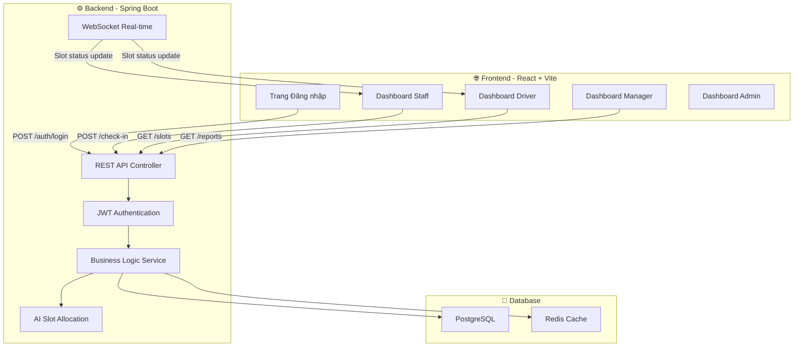
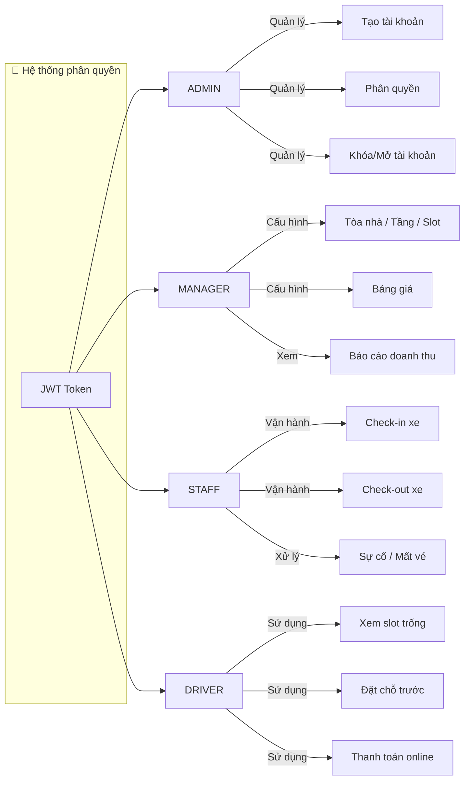
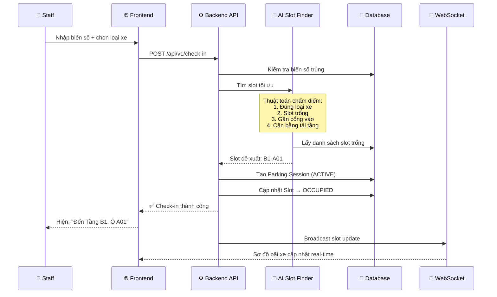
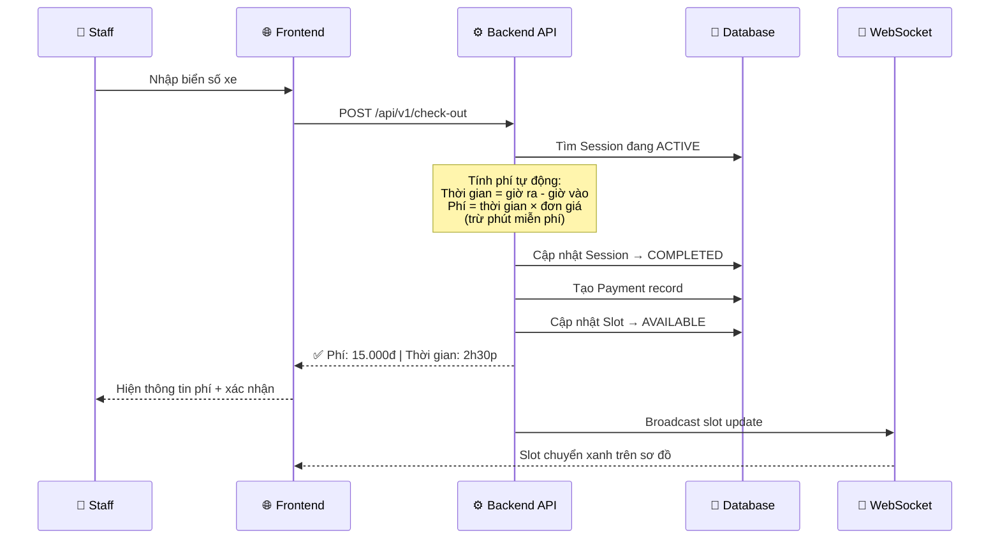
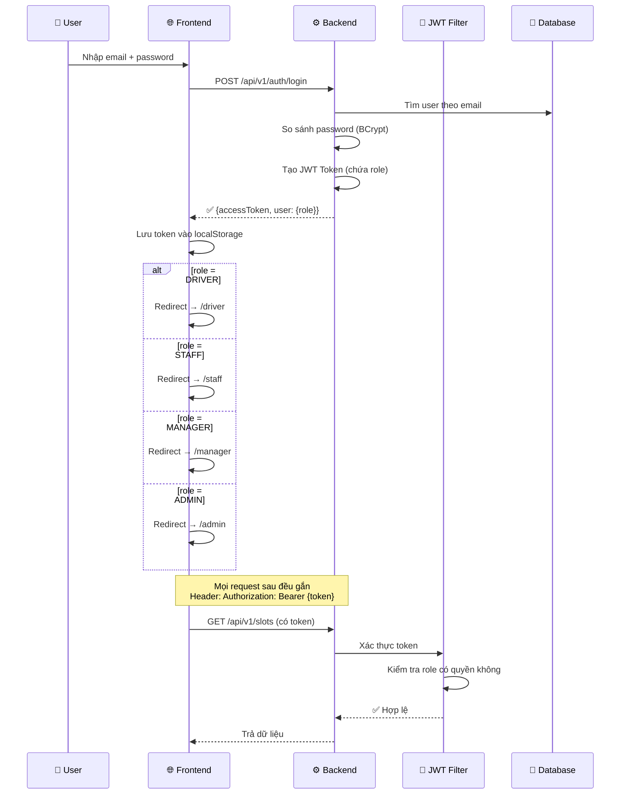
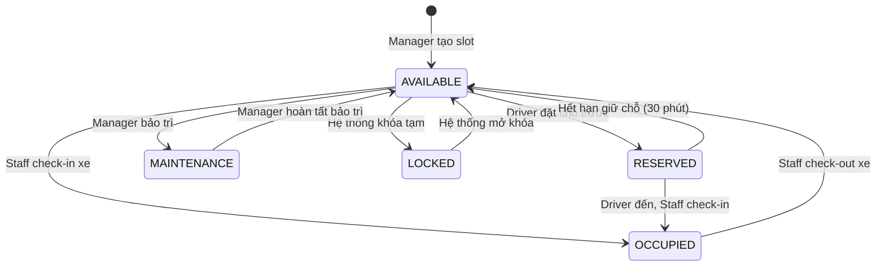
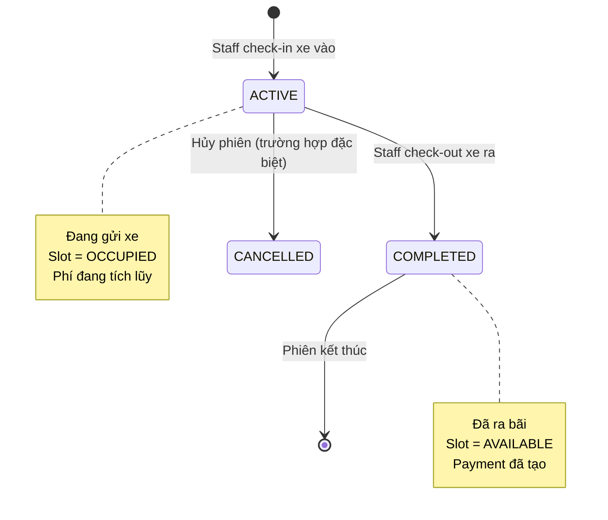
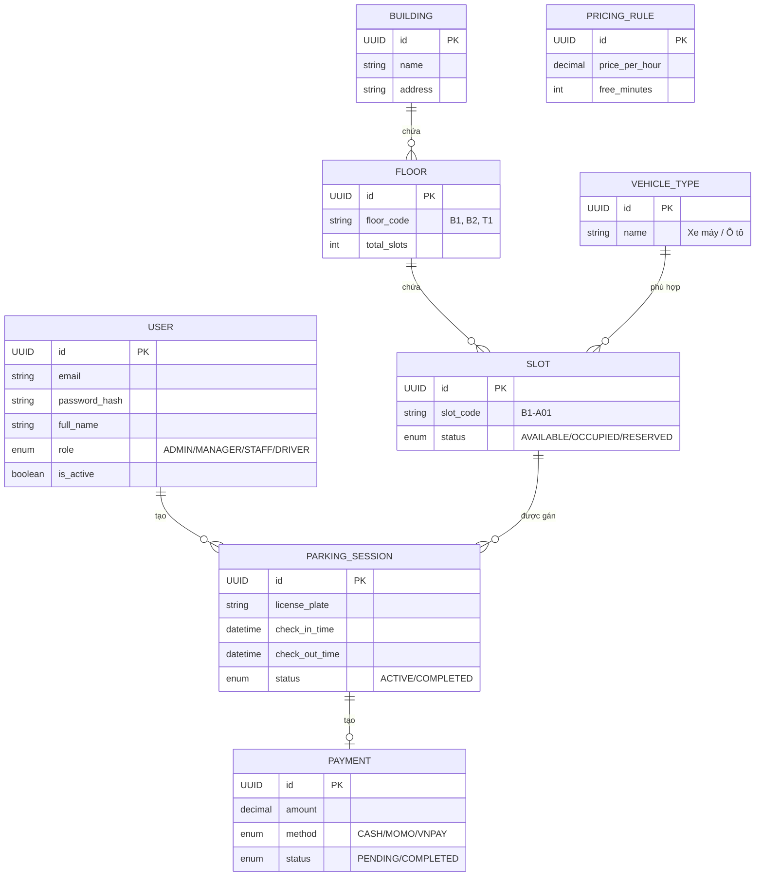
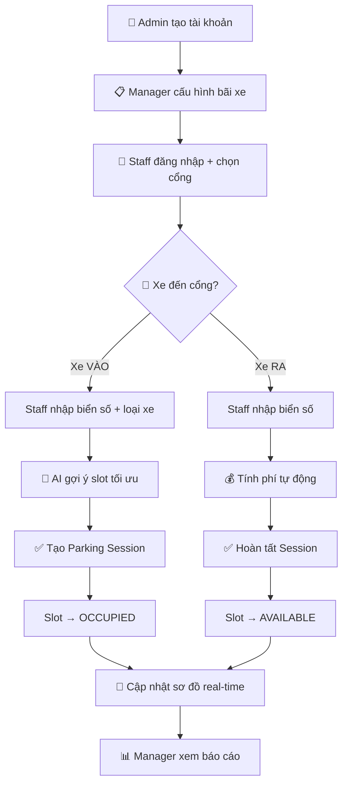

# Sơ Đồ Flow — SmartParking System

> Dùng để trình bày với giảng viên. Copy từng sơ đồ vào slide PowerPoint hoặc mở trực tiếp trên GitHub.

---

## 1. Sơ đồ Kiến trúc tổng thể (System Architecture)

---

## 2. Sơ đồ Phân quyền theo Role (RBAC)

---

## 3. Luồng Check-in (Xe vào bãi) ⭐ Quan trọng nhất

---

## 4. Luồng Check-out (Xe ra bãi)

---

## 5. Luồng Đăng nhập + Phân quyền

---

## 6. Sơ đồ Trạng thái Slot (State Diagram)

---

## 7. Sơ đồ Vòng đời Parking Session

---

## 8. Sơ đồ Database chính (ERD đơn giản)

---

## 9. Sơ đồ Luồng vận hành hằng ngày

---

## 10. Cách sử dụng sơ đồ khi trình bày

| Sơ đồ | Khi nào dùng | Ai nói |
|-------|-------------|--------|
| #1 Kiến trúc | Mở đầu giới thiệu | An |
| #2 Phân quyền | Nói về actor/role | An hoặc Tùng |
| #3 Check-in ⭐ | **Luồng quan trọng nhất** | An |
| #4 Check-out | Nối tiếp check-in | An |
| #5 Đăng nhập | Nói về bảo mật | Tùng |
| #6 Trạng thái Slot | Nói về business rule | Toàn |
| #7 Parking Session | Giải thích đối tượng trung tâm | An |
| #8 ERD | Nói về database | Toàn |
| #9 Luồng hằng ngày | Tóm tắt cuối | An |

> **Tip:** In sơ đồ #3 (Check-in) và #4 (Check-out) ra giấy A4 mang theo phòng khi cô hỏi chi tiết.
